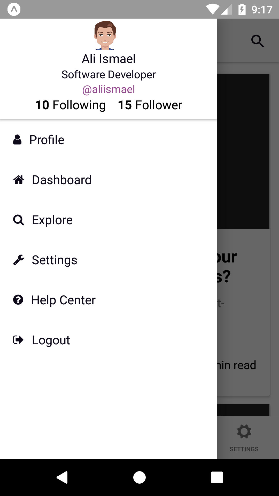

## blog-app-mobile

mobile app using React-native with typescript for [blog-app-api](https://github.com/aliasmael/blog-app-api).

## Preparing the development environment

# Preparing API

You may need to follow instructions in [blog-app-api](https://github.com/aliasmael/blog-app-api) repository.

# Starting development server
Install packages
 ```sh
cd /root-folder/
npm install
```

Gulp watch
 ```sh
cd /root-folder/
gulp
```

Start a development server, and print a QR code in your terminal
 ```sh
cd /root-folder/
npm start
```

# Running App with [Expo](https://expo.io/)

Install the [Expo](https://expo.io/) client app on your iOS or Android phone and connect to the same wireless network as your computer. Using the Expo app, scan the QR code from your terminal to open your project.

# Running App on a simulator or virtual device

Instead of using `npm start` command, you can specify a virtual device `npm start -avd { DEVICE_NAME like 'Nexus_5_API_25' }`

# Screenshots


<br />



